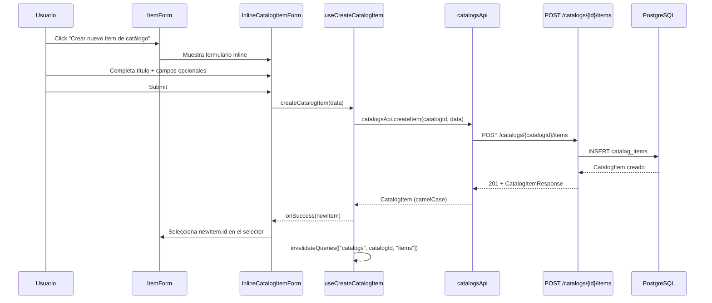
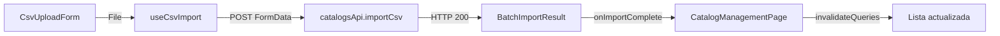
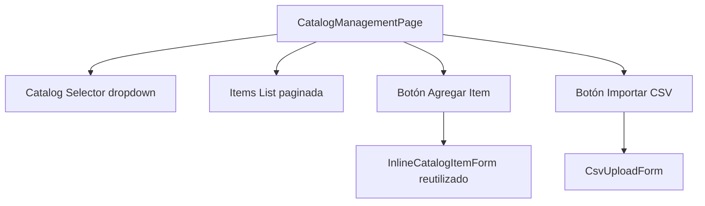

# Diseño: Creación Inline de Catalog Items

## Overview

Este feature permite a los usuarios crear nuevos `CatalogItem` directamente desde el formulario de agregar ítem a una colección (`ItemForm`), sin abandonar el flujo. Actualmente, si un ítem no existe en el catálogo, el usuario debe navegar a otra página para crearlo y luego volver. Con esta mejora, se agrega un formulario inline colapsable dentro del `ItemForm` que crea el `CatalogItem` vía API y lo selecciona automáticamente.

### Decisiones de Diseño

1. **Formulario inline colapsable vs modal separado**: Se opta por un formulario inline colapsable dentro del modal existente de `ItemForm`. Esto evita modales anidados (mala UX) y mantiene el contexto visual del usuario.

2. **Reutilización del endpoint existente**: El endpoint `POST /catalogs/{catalog_id}/items` ya existe en `CatalogService.create_item()`. No se necesita un endpoint nuevo, solo exponer la funcionalidad de creación desde el frontend en el contexto del `ItemForm`.

3. **Invalidación de cache con React Query**: Al crear un catalog item inline, se invalida la query key `["catalogs", catalogId, "items"]` para que el selector se actualice automáticamente sin recargar la página.

4. **Validación dual**: Validación en frontend (campo título no vacío) + validación en backend (Pydantic schema existente `CatalogItemCreate`). No se duplica lógica, cada capa valida lo que le corresponde.

## Architecture



### Capas afectadas

- **Backend**: Sin cambios en modelos ni servicios. El endpoint `POST /catalogs/{catalog_id}/items` ya existe y funciona correctamente.
- **Frontend - Services**: Agregar método `createItem` a `catalogsApi`.
- **Frontend - Types**: Agregar interface `CatalogItemCreate` al archivo de tipos.
- **Frontend - Hooks**: Crear hook `useCreateCatalogItem` con mutation de React Query.
- **Frontend - Components**: Crear componente `InlineCatalogItemForm` y modificar `ItemForm` para integrarlo.
- **Frontend - i18n**: Agregar traducciones es/en para el formulario inline.

## Components and Interfaces

### Backend (sin cambios)

El endpoint existente ya cubre la necesidad:

```python
# backend/api/routes/catalogs.py (ya existe)
@router.post("/{catalog_id}/items", response_model=CatalogItemResponse, status_code=201)
async def create_catalog_item(catalog_id: str, data: CatalogItemCreate, ...) -> CatalogItemResponse:
    return await service.create_item(catalog_id, data)
```

El schema `CatalogItemCreate` ya valida título obligatorio (min_length=1, max_length=500) y todos los campos opcionales.

### Frontend - API Service

Agregar a `catalogsApi` en `frontend/src/services/catalogsApi.ts`:

```typescript
createItem: (catalogId: string, data: CatalogItemCreate): Promise<CatalogItem> =>
  fetchApi<CatalogItem>(`/catalogs/${catalogId}/items`, {
    method: "POST",
    body: JSON.stringify(toSnakeCase(data)),
  }),
```

### Frontend - Types

Agregar a `frontend/src/types/item.ts`:

```typescript
export interface CatalogItemCreate {
  title: string;
  subtitle?: string;
  description?: string;
  manufacturer?: string;
  publisher?: string;
  developer?: string;
  brand?: string;
  language?: string;
  region?: string;
  rarity?: string;
  customFields?: Record<string, unknown>;
  coverImageUrl?: string;
}
```

### Frontend - Hook `useCreateCatalogItem`

Nuevo archivo `frontend/src/hooks/useCreateCatalogItem.ts`:

```typescript
import { useMutation, useQueryClient } from "@tanstack/react-query";
import { catalogsApi } from "../services/catalogsApi";
import type { CatalogItem, CatalogItemCreate } from "../types/item";

export function useCreateCatalogItem(catalogId: string) {
  const queryClient = useQueryClient();

  return useMutation<CatalogItem, Error, CatalogItemCreate>({
    mutationFn: (data) => catalogsApi.createItem(catalogId, data),
    onSuccess: () => {
      queryClient.invalidateQueries({
        queryKey: ["catalogs", catalogId, "items"],
      });
    },
  });
}
```

### Frontend - Componente `InlineCatalogItemForm`

Nuevo archivo `frontend/src/components/items/InlineCatalogItemForm.tsx`:

**Props:**

```typescript
interface InlineCatalogItemFormProps {
  onCreated: (item: CatalogItem) => void;
  onCancel: () => void;
  catalogId: string;
  isLoading: boolean;
}
```

**Comportamiento:**
- Campo título obligatorio con validación local (no vacío, no solo espacios)
- Campos opcionales colapsados por defecto (subtítulo, descripción, fabricante, etc.)
- Auto-focus en el campo título al montar
- Botón submit deshabilitado durante carga
- Al crear exitosamente, llama `onCreated(newItem)` para que `ItemForm` seleccione el nuevo ítem
- Al cancelar, llama `onCancel()` sin perder datos del formulario padre
- Escape cierra el formulario inline

### Frontend - Modificación de `ItemForm`

Cambios en `frontend/src/components/items/ItemForm.tsx`:

- Agregar estado `showInlineForm: boolean`
- Agregar botón "Crear nuevo ítem de catálogo" junto al selector de catalog items
- Cuando `showInlineForm` es true, mostrar `InlineCatalogItemForm` en lugar del selector
- Al recibir `onCreated(item)`, setear `catalogItemId = item.id` y ocultar el formulario inline
- Requiere recibir `catalogId` como nueva prop para pasarlo al formulario inline

**Nueva prop necesaria en `ItemFormProps`:**

```typescript
interface ItemFormProps {
  catalogItems: CatalogItem[];
  catalogId: string;  // NUEVO: necesario para crear items inline
  onSubmit: (data: ItemFormData) => void;
  onCancel: () => void;
  isLoading: boolean;
}
```

## Data Models

### Backend

No se requieren cambios en los modelos de datos. El modelo `CatalogItem` existente ya soporta todos los campos necesarios. El schema `CatalogItemCreate` de Pydantic ya valida correctamente:

- `title`: obligatorio, min_length=1, max_length=500
- `catalog_id`: obligatorio (se pasa vía URL path parameter)
- Campos opcionales: subtitle, description, manufacturer, publisher, developer, brand, language, region, rarity, custom_fields, cover_image_url

Se agregan schemas nuevos para CSV import:

```python
# backend/api/schemas/csv_import.py
class BatchImportError(BaseModel):
    row: int
    message: str

class BatchImportResult(BaseModel):
    created_count: int
    error_count: int
    errors: list[BatchImportError]
```

### Frontend

Se agrega la interface `CatalogItemCreate` al archivo de tipos existente. Se agregan tipos para CSV import:

```typescript
// frontend/src/types/catalog.ts
interface BatchImportError {
  row: number;
  message: string;
}

interface BatchImportResult {
  createdCount: number;
  errorCount: number;
  errors: BatchImportError[];
}
```

### Flujo de datos — Creación inline


### Flujo de datos — CSV Import



## CSV Import — Diseño Backend

### CsvImportService

Nuevo servicio en `backend/api/services/csv_import_service.py`:

```python
class CsvImportService:
    MAX_FILE_SIZE = 5 * 1024 * 1024  # 5 MB
    REQUIRED_COLUMNS = {"title"}
    OPTIONAL_COLUMNS = {
        "subtitle", "description", "manufacturer", "publisher",
        "developer", "brand", "language", "region", "rarity",
        "sku", "upc",
    }

    def __init__(self, db: AsyncSession) -> None:
        self._db = db

    async def import_catalog_items(
        self, catalog_id: str, file_content: bytes, filename: str,
    ) -> BatchImportResult:
        """Parse CSV and create valid CatalogItems."""
```

**Decisiones de diseño:**

1. **Procesamiento parcial**: Si el CSV tiene filas válidas e inválidas, se crean las válidas y se reportan las inválidas. No es todo-o-nada.
2. **Validación en dos fases**: Primero se valida el archivo (tamaño, formato, headers), luego se validan las filas individualmente.
3. **Columnas ignoradas**: Columnas del CSV que no corresponden a campos del modelo se ignoran silenciosamente.
4. **Actualización de total_items**: Se incrementa una sola vez al final con el conteo de items creados exitosamente.

### Endpoint CSV

```python
# backend/api/routes/catalogs.py
@router.post("/{catalog_id}/import-csv", response_model=BatchImportResult)
async def import_csv(
    catalog_id: str,
    file: UploadFile,
    service: CsvImportService = Depends(get_csv_import_service),
) -> BatchImportResult:
    """Import catalog items from a CSV file."""
```

- Valida Content-Type: `text/csv` o `application/vnd.ms-excel`
- Valida tamaño: 413 si excede 5 MB
- Retorna 200 con `BatchImportResult`

## Catalog Management Page — Diseño Frontend

### Arquitectura de la página



**Decisiones de diseño:**

1. **Reutilización de InlineCatalogItemForm**: El mismo componente usado en `ItemForm` se reutiliza aquí con `catalogId` pre-seleccionado. Esto cumple el Requirement 3 (componente reutilizable).
2. **Selector de catálogo**: Dropdown que carga catálogos disponibles. Al seleccionar uno, se cargan sus items.
3. **Estados vacíos**: Mensaje cuando no hay catálogos, y mensaje diferente cuando el catálogo seleccionado no tiene items.
4. **Actualización optimista**: Al crear un item inline o importar CSV, se invalidan las queries de React Query para refrescar la lista sin recargar la página.


## Correctness Properties

*Una propiedad es una característica o comportamiento que debe mantenerse verdadero en todas las ejecuciones válidas de un sistema — esencialmente, una declaración formal sobre lo que el sistema debe hacer. Las propiedades sirven como puente entre especificaciones legibles por humanos y garantías de corrección verificables por máquina.*

### Property 1: Validación de título determina éxito de creación

*For any* string `s`, crear un catalog item con título `s` en un catálogo existente debe tener éxito si y solo si `s` no está vacío, no está compuesto solo de espacios en blanco, y tiene longitud ≤ 500 caracteres. Si `s` es vacío, solo whitespace, o excede 500 caracteres, la creación debe ser rechazada.

**Validates: Requirements 1.3, 1.4, 3.1**

### Property 2: Catálogo inexistente rechaza creación

*For any* catalog_id que no corresponda a un catálogo existente en la base de datos, y cualquier datos válidos de CatalogItemCreate, la creación debe fallar con un error NotFoundError.

**Validates: Requirements 3.2**

### Property 3: Cancelar creación inline preserva estado del formulario padre

*For any* estado del formulario padre (cualquier combinación de condition, notes, purchasePrice previamente ingresados), al abrir y luego cancelar el formulario inline de creación, los valores del formulario padre deben permanecer idénticos a los valores previos a la apertura.

**Validates: Requirements 2.2**

### Property 4: Completitud de traducciones i18n

*For any* locale soportado (es, en) y cualquier clave de traducción utilizada por el componente `InlineCatalogItemForm`, la clave debe resolver a un string no vacío.

**Validates: Requirements 5.1**

### Property 5: Consistencia de BatchImportResult

*For any* archivo CSV con N filas de datos (excluyendo header), el resultado de la importación debe cumplir que `created_count + error_count == N`. Ninguna fila puede desaparecer ni duplicarse en el procesamiento.

**Validates: Requirements 5.4, 5.5**

## Error Handling

### Backend

Los errores ya están manejados por la infraestructura existente:

| Error | Excepción | HTTP Status | Cuándo |
|-------|-----------|-------------|--------|
| Catálogo no existe | `NotFoundError` | 404 | `catalog_id` inválido en URL |
| Título vacío | Pydantic `ValidationError` | 422 | `title` vacío o ausente |
| Título muy largo | Pydantic `ValidationError` | 422 | `title` > 500 chars |
| Archivo muy grande | `ValidationError` | 413 | CSV > 5 MB |
| Content-Type inválido | Pydantic `ValidationError` | 422 | No es text/csv ni application/vnd.ms-excel |
| CSV sin datos | `ValidationError` | 422 | Archivo vacío o solo headers |
| CSV sin columna title | `ValidationError` | 422 | Header no contiene `title` |

Los exception handlers globales en `main.py` ya convierten `NotFoundError` → 404 y errores de Pydantic → 422 con detalle descriptivo.

### Frontend

| Escenario | Manejo |
|-----------|--------|
| Validación local falla (título vacío/whitespace) | Mostrar error inline, no llamar API |
| API retorna 404 (catálogo no existe) | Mostrar `ErrorMessage` con texto i18n |
| API retorna 422 (validación backend) | Mostrar detalle del error del backend |
| Error de red | Mostrar error genérico con opción de reintentar |
| Mutation en progreso | Deshabilitar botón submit, mostrar spinner |
| CSV: archivo no es .csv | Mostrar error local, no subir |
| CSV: archivo > 5 MB | Mostrar error local, no subir |
| CSV: importación con errores parciales | Mostrar resumen + detalle de errores por fila |

El hook `useCreateCatalogItem` expone `error`, `isPending` y `isError` del mutation de React Query para que el componente maneje cada estado.

## Testing Strategy

### Enfoque dual: Unit Tests + Property-Based Tests

Se utilizan ambos tipos de tests de forma complementaria:
- **Unit tests**: Ejemplos específicos, edge cases, interacciones UI, accesibilidad
- **Property tests**: Propiedades universales que deben cumplirse para todos los inputs

### Backend Tests (pytest + Hypothesis)

**Library PBT**: `hypothesis` (Python)

**Unit tests** (`backend/tests/unit/test_services/test_catalog_service.py`):
- Crear catalog item con datos válidos retorna item con título correcto
- Crear catalog item en catálogo inexistente lanza NotFoundError
- Crear catalog item con título vacío es rechazado por Pydantic
- Crear catalog item incrementa total_items del catálogo

**Unit tests** (`backend/tests/unit/test_services/test_csv_import_service.py`):
- CSV válido crea items correctamente
- CSV con filas válidas e inválidas: crea válidos, reporta errores
- CSV sin columna title es rechazado
- CSV vacío retorna error
- CSV con columnas no reconocidas las ignora
- Archivo > 5 MB es rechazado
- Catálogo inexistente lanza NotFoundError
- total_items se actualiza correctamente

**Integration tests** (`backend/tests/integration/test_routes/test_catalogs.py`):
- POST `/catalogs/{id}/items` con datos válidos retorna 201
- POST `/catalogs/{id}/items` con catálogo inexistente retorna 404
- POST `/catalogs/{id}/items` con título vacío retorna 422

**Integration tests** (`backend/tests/integration/test_routes/test_catalog_csv_import.py`):
- POST `/catalogs/{id}/import-csv` con CSV válido retorna 200
- POST con catálogo inexistente retorna 404
- POST con archivo > 5 MB retorna 413
- POST con Content-Type inválido retorna 422

**Property tests** (`backend/tests/unit/test_services/test_catalog_item_creation_properties.py`):
- Cada test debe correr mínimo 100 iteraciones

```python
# Feature: inline-catalog-item-creation, Property 1: Validación de título determina éxito de creación
# Feature: inline-catalog-item-creation, Property 2: Catálogo inexistente rechaza creación
```

**Property tests** (`backend/tests/unit/test_services/test_csv_import_properties.py`):

```python
# Feature: inline-catalog-item-creation, Property 5: Consistencia de BatchImportResult
```

### Frontend Tests (Vitest + fast-check)

**Library PBT**: `fast-check` (TypeScript)

**Unit tests** (`frontend/src/components/items/InlineCatalogItemForm.test.tsx`):
- Renderiza campo título con label correcto
- Muestra error cuando título está vacío al submit
- Auto-focus en campo título al montar
- Botón submit deshabilitado durante carga
- Escape cierra el formulario
- Test de accesibilidad con axe-core (obligatorio)

**Unit tests** (`frontend/src/components/items/ItemForm.test.tsx`):
- Muestra botón "Crear nuevo ítem de catálogo"
- Click en botón muestra formulario inline
- Crear item inline selecciona el nuevo item en el selector

**Unit tests** (`frontend/src/components/catalogs/CsvUploadForm.test.tsx`):
- Renderiza input de archivo con label correcto
- Rechaza archivos no-CSV
- Rechaza archivos > 5 MB
- Muestra resumen de resultados después de importación
- Muestra errores por fila
- Test de accesibilidad con axe-core

**Unit tests** (`frontend/src/pages/CatalogManagementPage.test.tsx`):
- Muestra selector de catálogos
- Muestra lista de items del catálogo seleccionado
- Estados vacíos (sin catálogos, sin items)
- Botón agregar item muestra InlineCatalogItemForm
- Botón importar CSV muestra CsvUploadForm
- Test de accesibilidad con axe-core

**Property tests** (`frontend/src/components/items/InlineCatalogItemForm.property.test.tsx`):
- Cada test debe correr mínimo 100 iteraciones

```typescript
// Feature: inline-catalog-item-creation, Property 3: Cancelar creación inline preserva estado del formulario padre
// Feature: inline-catalog-item-creation, Property 4: Completitud de traducciones i18n
```

### Coverage

Siguiendo los estándares del proyecto (Fase 1: >70% coverage):
- Todos los componentes nuevos deben tener tests
- Todos los hooks nuevos deben tener tests
- Tests de accesibilidad con axe-core en cada componente React nuevo
