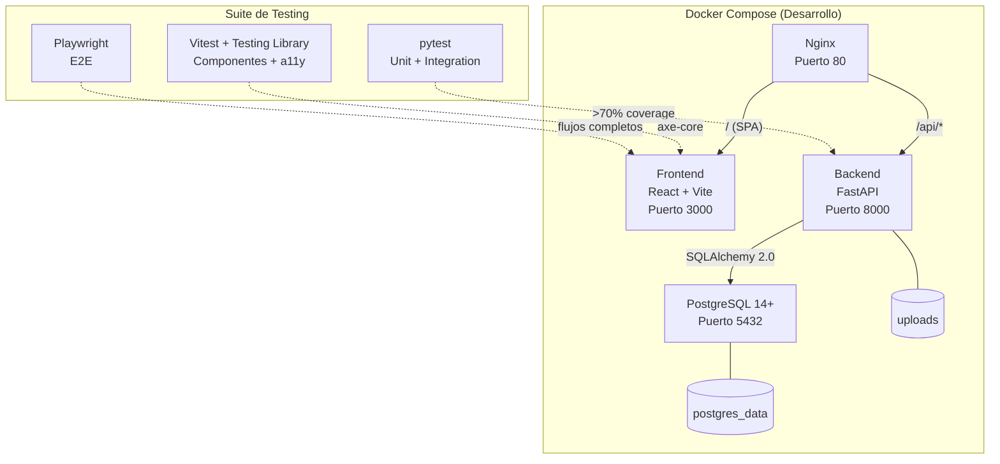
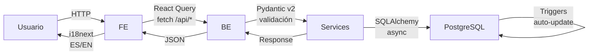
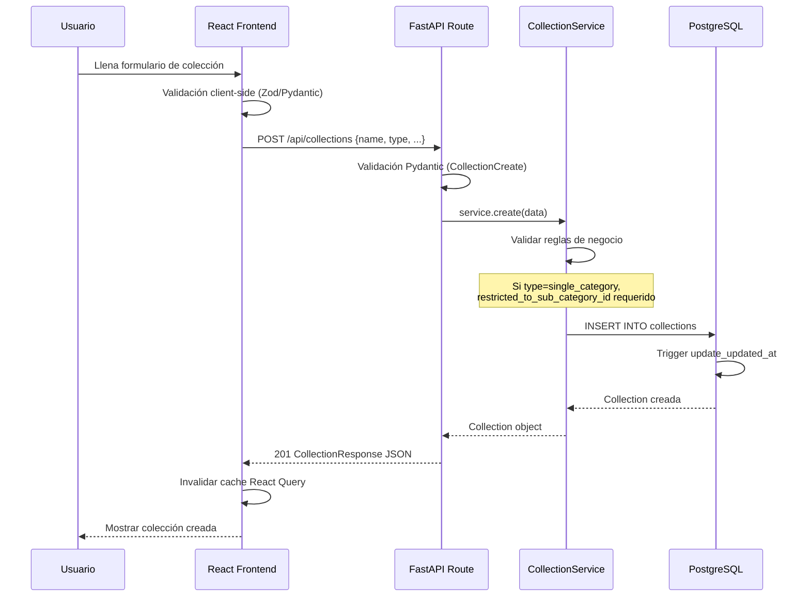
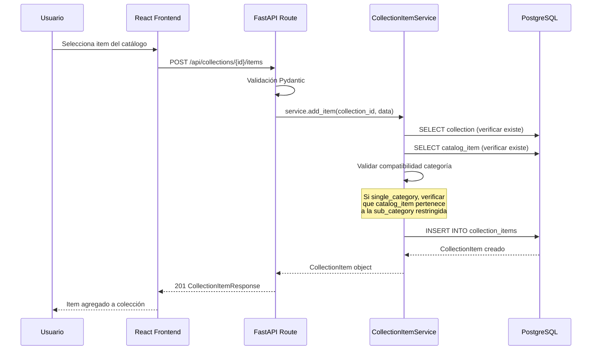
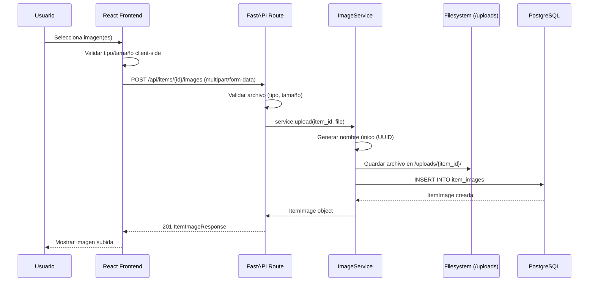

# Documento de Diseño: Phase 1 - MVP Setup de H.O.A.R.D.

## Resumen General

H.O.A.R.D. (Hobby Organization, Archive & Registry Database) es un sistema de gestión de colecciones multi-categoría, self-hosted y open source. Esta Fase 1 (MVP) establece los cimientos del proyecto: infraestructura Docker, modelos de base de datos (17 tablas), endpoints CRUD básicos para colecciones/catálogos/items, sistema de upload de imágenes, frontend React con i18n (ES/EN), y una suite de testing robusta con >70% de coverage.

El MVP permite a un coleccionista crear colecciones (single_category, multi_category, mixed), agregar items del catálogo a sus colecciones, subir imágenes de sus items, y navegar la interfaz en español o inglés. La arquitectura sigue Clean Architecture con separación estricta de capas: Routes → Services → Models (backend) y Components → Hooks → Services (frontend).

El foco principal de esta fase es el testing: cada pieza de código tendrá tests asociados. Backend con pytest (unit + integration, >70% coverage), frontend con Vitest + Testing Library (componentes + accesibilidad con axe-core), y Playwright para E2E.

## Arquitectura



### Flujo de Datos Principal



## Diagramas de Secuencia

### Crear Colección



### Agregar Item a Colección



### Upload de Imagen



## Componentes e Interfaces

### Backend - Capa de Presentación (Routes)

**Propósito**: Recibir requests HTTP, validar entrada con Pydantic, delegar a services, devolver responses.

```python
# api/routes/collections.py
router = APIRouter(prefix="/collections", tags=["collections"])

@router.get("", response_model=list[CollectionResponse])
async def list_collections(
    skip: int = Query(0, ge=0),
    limit: int = Query(100, ge=1, le=500),
    service: CollectionService = Depends(get_collection_service),
) -> list[CollectionResponse]: ...

@router.get("/{collection_id}", response_model=CollectionResponse)
async def get_collection(
    collection_id: UUID,
    service: CollectionService = Depends(get_collection_service),
) -> CollectionResponse: ...

@router.post("", response_model=CollectionResponse, status_code=201)
async def create_collection(
    data: CollectionCreate,
    service: CollectionService = Depends(get_collection_service),
) -> CollectionResponse: ...

@router.put("/{collection_id}", response_model=CollectionResponse)
async def update_collection(
    collection_id: UUID,
    data: CollectionUpdate,
    service: CollectionService = Depends(get_collection_service),
) -> CollectionResponse: ...

@router.delete("/{collection_id}", status_code=204)
async def delete_collection(
    collection_id: UUID,
    service: CollectionService = Depends(get_collection_service),
) -> None: ...
```

**Responsabilidades**:
- Validación de formato de entrada (Pydantic)
- Paginación (skip/limit)
- Conversión de excepciones de dominio a HTTPException
- NO contiene lógica de negocio

### Backend - Capa de Negocio (Services)

**Propósito**: Toda la lógica de negocio, validaciones de dominio, orquestación de operaciones.

```python
# api/services/collection_service.py
class CollectionService:
    def __init__(self, db: AsyncSession) -> None:
        self._db = db

    async def list(self, skip: int = 0, limit: int = 100) -> list[Collection]: ...
    async def get_by_id(self, collection_id: UUID) -> Collection: ...
    async def create(self, data: CollectionCreate) -> Collection: ...
    async def update(self, collection_id: UUID, data: CollectionUpdate) -> Collection: ...
    async def delete(self, collection_id: UUID) -> None: ...
```

```python
# api/services/collection_item_service.py
class CollectionItemService:
    def __init__(self, db: AsyncSession) -> None:
        self._db = db

    async def list_by_collection(
        self, collection_id: UUID, skip: int = 0, limit: int = 100
    ) -> list[CollectionItem]: ...
    async def get_by_id(self, item_id: UUID) -> CollectionItem: ...
    async def add_item(
        self, collection_id: UUID, data: CollectionItemCreate
    ) -> CollectionItem: ...
    async def update(
        self, item_id: UUID, data: CollectionItemUpdate
    ) -> CollectionItem: ...
    async def delete(self, item_id: UUID) -> None: ...
```

```python
# api/services/catalog_service.py
class CatalogService:
    def __init__(self, db: AsyncSession) -> None:
        self._db = db

    async def list_catalogs(
        self, skip: int = 0, limit: int = 100
    ) -> list[Catalog]: ...
    async def get_catalog(self, catalog_id: UUID) -> Catalog: ...
    async def create_catalog(self, data: CatalogCreate) -> Catalog: ...
    async def list_items(
        self, catalog_id: UUID, skip: int = 0, limit: int = 100
    ) -> list[CatalogItem]: ...
    async def get_item(self, item_id: UUID) -> CatalogItem: ...
    async def create_item(
        self, catalog_id: UUID, data: CatalogItemCreate
    ) -> CatalogItem: ...
```

```python
# api/services/image_service.py
class ImageService:
    def __init__(self, db: AsyncSession, upload_dir: str) -> None:
        self._db = db
        self._upload_dir = upload_dir

    async def upload(
        self, collection_item_id: UUID, file: UploadFile
    ) -> ItemImage: ...
    async def list_by_item(self, collection_item_id: UUID) -> list[ItemImage]: ...
    async def delete(self, image_id: UUID) -> None: ...
    def _validate_file(self, file: UploadFile) -> None: ...
    def _generate_path(self, item_id: UUID, filename: str) -> str: ...
```

### Backend - Dependencias (Inyección)

```python
# api/dependencies.py
from sqlalchemy.ext.asyncio import AsyncSession
from core.database import get_async_session

async def get_db() -> AsyncGenerator[AsyncSession, None]:
    """Provee sesión de base de datos."""
    async with get_async_session() as session:
        yield session

async def get_collection_service(
    db: AsyncSession = Depends(get_db),
) -> CollectionService:
    return CollectionService(db)

async def get_collection_item_service(
    db: AsyncSession = Depends(get_db),
) -> CollectionItemService:
    return CollectionItemService(db)

async def get_catalog_service(
    db: AsyncSession = Depends(get_db),
) -> CatalogService:
    return CatalogService(db)

async def get_image_service(
    db: AsyncSession = Depends(get_db),
    settings: Settings = Depends(get_settings),
) -> ImageService:
    return ImageService(db, settings.upload_dir)
```

### Backend - Excepciones de Dominio

```python
# core/exceptions.py
class DomainError(Exception):
    """Base para errores de dominio."""
    def __init__(self, message: str) -> None:
        self.message = message

class NotFoundError(DomainError):
    """Recurso no encontrado."""
    pass

class DuplicateError(DomainError):
    """Recurso duplicado."""
    pass

class ValidationError(DomainError):
    """Error de validación de negocio."""
    pass

class FileValidationError(DomainError):
    """Error de validación de archivo."""
    pass
```

### Frontend - Componentes

**Propósito**: Componentes presentacionales con accesibilidad integrada, i18n, y tipado estricto.

```typescript
// src/components/collections/CollectionCard.tsx
interface CollectionCardProps {
  collection: Collection;
  onEdit: (id: string) => void;
  onDelete: (id: string) => void;
}

export function CollectionCard({
  collection, onEdit, onDelete
}: CollectionCardProps): JSX.Element;

// src/components/collections/CollectionForm.tsx
interface CollectionFormProps {
  initialData?: CollectionFormData;
  subCategories: SubCategory[];
  onSubmit: (data: CollectionCreate | CollectionUpdate) => void;
  onCancel: () => void;
  isLoading: boolean;
}

export function CollectionForm({
  initialData, subCategories, onSubmit, onCancel, isLoading
}: CollectionFormProps): JSX.Element;

// src/components/collections/CollectionList.tsx
interface CollectionListProps {
  collections: Collection[];
  isLoading: boolean;
  error: Error | null;
  onEdit: (id: string) => void;
  onDelete: (id: string) => void;
}

export function CollectionList({
  collections, isLoading, error, onEdit, onDelete
}: CollectionListProps): JSX.Element;
```

### Frontend - Hooks

```typescript
// src/hooks/useCollections.ts
export function useCollections(): {
  collections: Collection[] | undefined;
  isLoading: boolean;
  error: Error | null;
  create: UseMutationResult<Collection, Error, CollectionCreate>;
  update: UseMutationResult<Collection, Error, { id: string; data: CollectionUpdate }>;
  remove: UseMutationResult<void, Error, string>;
};

// src/hooks/useCollectionItems.ts
export function useCollectionItems(collectionId: string): {
  items: CollectionItem[] | undefined;
  isLoading: boolean;
  error: Error | null;
  addItem: UseMutationResult<CollectionItem, Error, CollectionItemCreate>;
  updateItem: UseMutationResult<CollectionItem, Error, { id: string; data: CollectionItemUpdate }>;
  removeItem: UseMutationResult<void, Error, string>;
};
```

### Frontend - Services (API Client)

```typescript
// src/services/api.ts
const API_BASE_URL = import.meta.env.VITE_API_URL;

async function fetchApi<T>(endpoint: string, options?: RequestInit): Promise<T>;

export const collectionsApi = {
  list: (skip?: number, limit?: number) => fetchApi<Collection[]>(`/collections?skip=${skip}&limit=${limit}`),
  getById: (id: string) => fetchApi<Collection>(`/collections/${id}`),
  create: (data: CollectionCreate) => fetchApi<Collection>('/collections', { method: 'POST', body: JSON.stringify(data) }),
  update: (id: string, data: CollectionUpdate) => fetchApi<Collection>(`/collections/${id}`, { method: 'PUT', body: JSON.stringify(data) }),
  delete: (id: string) => fetchApi<void>(`/collections/${id}`, { method: 'DELETE' }),
};

export const collectionItemsApi = {
  list: (collectionId: string) => fetchApi<CollectionItem[]>(`/collections/${collectionId}/items`),
  add: (collectionId: string, data: CollectionItemCreate) => fetchApi<CollectionItem>(`/collections/${collectionId}/items`, { method: 'POST', body: JSON.stringify(data) }),
  update: (id: string, data: CollectionItemUpdate) => fetchApi<CollectionItem>(`/items/${id}`, { method: 'PUT', body: JSON.stringify(data) }),
  delete: (id: string) => fetchApi<void>(`/items/${id}`, { method: 'DELETE' }),
};

export const imagesApi = {
  list: (itemId: string) => fetchApi<ItemImage[]>(`/items/${itemId}/images`),
  upload: (itemId: string, file: File) => { /* multipart/form-data upload */ },
  delete: (imageId: string) => fetchApi<void>(`/images/${imageId}`, { method: 'DELETE' }),
};
```

## Modelos de Datos

### Modelos SQLAlchemy (Backend)

```python
# api/models/base.py
from sqlalchemy import Column, DateTime, func
from sqlalchemy.dialects.postgresql import UUID as PG_UUID
from sqlalchemy.orm import DeclarativeBase
import uuid

class Base(DeclarativeBase):
    pass

class TimestampMixin:
    created_at = Column(DateTime, server_default=func.now(), nullable=False)
    updated_at = Column(DateTime, server_default=func.now(), onupdate=func.now(), nullable=False)

class UUIDMixin:
    id = Column(PG_UUID(as_uuid=True), primary_key=True, default=uuid.uuid4)
```

```python
# api/models/collection.py
class Collection(UUIDMixin, TimestampMixin, Base):
    __tablename__ = "collections"

    name: Mapped[str] = mapped_column(String(200), nullable=False)
    description: Mapped[str | None] = mapped_column(Text)
    collection_type: Mapped[str] = mapped_column(
        String(50), default="single_category",
        # CHECK constraint: 'single_category', 'multi_category', 'mixed'
    )
    theme: Mapped[str | None] = mapped_column(String(100))
    theme_description: Mapped[str | None] = mapped_column(Text)
    restricted_to_sub_category_id: Mapped[uuid.UUID | None] = mapped_column(
        ForeignKey("sub_categories.id", ondelete="RESTRICT")
    )
    goal_description: Mapped[str | None] = mapped_column(Text)
    goal_items_count: Mapped[int | None] = mapped_column(Integer)
    display_order: Mapped[str] = mapped_column(String(50), default="custom")
    is_public: Mapped[bool] = mapped_column(Boolean, default=False)
    is_active: Mapped[bool] = mapped_column(Boolean, default=True)

    # Relaciones
    items: Mapped[list["CollectionItem"]] = relationship(back_populates="collection", cascade="all, delete-orphan")
    restricted_sub_category: Mapped["SubCategory | None"] = relationship()
```

```python
# api/models/catalog.py
class Catalog(UUIDMixin, TimestampMixin, Base):
    __tablename__ = "catalogs"

    sub_category_id: Mapped[uuid.UUID] = mapped_column(
        ForeignKey("sub_categories.id", ondelete="RESTRICT"), nullable=False
    )
    name: Mapped[str] = mapped_column(String(200), nullable=False)
    description: Mapped[str | None] = mapped_column(Text)
    total_items: Mapped[int] = mapped_column(Integer, default=0)
    is_active: Mapped[bool] = mapped_column(Boolean, default=True)

    # Relaciones
    sub_category: Mapped["SubCategory"] = relationship()
    items: Mapped[list["CatalogItem"]] = relationship(back_populates="catalog", cascade="all, delete-orphan")

class CatalogItem(UUIDMixin, TimestampMixin, Base):
    __tablename__ = "catalog_items"

    catalog_id: Mapped[uuid.UUID] = mapped_column(
        ForeignKey("catalogs.id", ondelete="CASCADE"), nullable=False
    )
    title: Mapped[str] = mapped_column(String(500), nullable=False)
    subtitle: Mapped[str | None] = mapped_column(String(500))
    description: Mapped[str | None] = mapped_column(Text)
    release_date: Mapped[date | None] = mapped_column(Date)
    manufacturer: Mapped[str | None] = mapped_column(String(200))
    publisher: Mapped[str | None] = mapped_column(String(200))
    developer: Mapped[str | None] = mapped_column(String(200))
    brand: Mapped[str | None] = mapped_column(String(200))
    language: Mapped[str | None] = mapped_column(String(50))
    region: Mapped[str | None] = mapped_column(String(50))
    rarity: Mapped[str | None] = mapped_column(String(50))
    custom_fields: Mapped[dict] = mapped_column(JSONB, default=dict)
    cover_image_url: Mapped[str | None] = mapped_column(String(1000))

    # Relaciones
    catalog: Mapped["Catalog"] = relationship(back_populates="items")
```

### Schemas Pydantic (Validación)

```python
# api/schemas/collection.py
class CollectionBase(BaseModel):
    name: str = Field(..., min_length=1, max_length=200, description="Nombre de la colección")
    description: str | None = Field(None, max_length=5000)
    collection_type: Literal["single_category", "multi_category", "mixed"] = "single_category"
    theme: str | None = Field(None, max_length=100)
    restricted_to_sub_category_id: UUID | None = None
    goal_description: str | None = None
    goal_items_count: int | None = Field(None, ge=0)
    display_order: str = "custom"
    is_public: bool = False

    @model_validator(mode="after")
    def validate_single_category_restriction(self) -> "CollectionBase":
        """Si type=single_category, restricted_to_sub_category_id es obligatorio."""
        if self.collection_type == "single_category" and self.restricted_to_sub_category_id is None:
            raise ValueError(
                "restricted_to_sub_category_id es obligatorio para colecciones single_category"
            )
        return self

class CollectionCreate(CollectionBase):
    pass

class CollectionUpdate(BaseModel):
    name: str | None = Field(None, min_length=1, max_length=200)
    description: str | None = None
    theme: str | None = None
    goal_description: str | None = None
    goal_items_count: int | None = Field(None, ge=0)
    display_order: str | None = None
    is_public: bool | None = None
    is_active: bool | None = None

class CollectionResponse(CollectionBase):
    id: UUID
    is_active: bool
    created_at: datetime
    updated_at: datetime

    model_config = ConfigDict(from_attributes=True)
```

```python
# api/schemas/collection_item.py
class CollectionItemCreate(BaseModel):
    catalog_item_id: UUID
    condition: Literal["mint", "near_mint", "excellent", "good", "fair", "poor"]
    is_complete: bool = False
    notes: str | None = None
    purchase_price: Decimal | None = Field(None, ge=0, decimal_places=2)
    purchase_currency: str = "USD"
    purchase_date: date | None = None
    acquisition_type: Literal["purchase", "gift", "trade", "found", "inherited"] | None = None
    storage_location: str | None = None

class CollectionItemResponse(BaseModel):
    id: UUID
    collection_id: UUID
    catalog_item_id: UUID
    condition: str
    is_complete: bool
    notes: str | None
    purchase_price: Decimal | None
    created_at: datetime
    updated_at: datetime

    model_config = ConfigDict(from_attributes=True)
```

**Reglas de Validación**:
- `collection_type` solo acepta: `single_category`, `multi_category`, `mixed`
- Si `collection_type == "single_category"`, `restricted_to_sub_category_id` es obligatorio
- `condition` solo acepta: `mint`, `near_mint`, `excellent`, `good`, `fair`, `poor`
- `purchase_price` debe ser >= 0
- `name` no puede estar vacío ni exceder 200 caracteres

### Tipos TypeScript (Frontend)

```typescript
// src/types/collection.ts
type CollectionType = "single_category" | "multi_category" | "mixed";
type DisplayOrder = "alphabetical" | "release_date" | "acquisition_date" | "custom" | "value" | "category";

interface Collection {
  id: string;
  name: string;
  description: string | null;
  collectionType: CollectionType;
  theme: string | null;
  themeDescription: string | null;
  restrictedToSubCategoryId: string | null;
  goalDescription: string | null;
  goalItemsCount: number | null;
  displayOrder: DisplayOrder;
  isPublic: boolean;
  isActive: boolean;
  createdAt: string;
  updatedAt: string;
}

interface CollectionCreate {
  name: string;
  description?: string;
  collectionType: CollectionType;
  theme?: string;
  restrictedToSubCategoryId?: string;
  goalDescription?: string;
  goalItemsCount?: number;
  displayOrder?: DisplayOrder;
  isPublic?: boolean;
}

interface CollectionUpdate {
  name?: string;
  description?: string;
  theme?: string;
  goalDescription?: string;
  goalItemsCount?: number;
  displayOrder?: DisplayOrder;
  isPublic?: boolean;
  isActive?: boolean;
}
```

```typescript
// src/types/item.ts
type ItemCondition = "mint" | "near_mint" | "excellent" | "good" | "fair" | "poor";
type AcquisitionType = "purchase" | "gift" | "trade" | "found" | "inherited";

interface CollectionItem {
  id: string;
  collectionId: string;
  catalogItemId: string;
  condition: ItemCondition;
  isComplete: boolean;
  notes: string | null;
  purchasePrice: number | null;
  purchaseCurrency: string;
  purchaseDate: string | null;
  acquisitionType: AcquisitionType | null;
  storageLocation: string | null;
  createdAt: string;
  updatedAt: string;
}

interface CatalogItem {
  id: string;
  catalogId: string;
  title: string;
  subtitle: string | null;
  description: string | null;
  releaseDate: string | null;
  manufacturer: string | null;
  publisher: string | null;
  developer: string | null;
  brand: string | null;
  language: string | null;
  region: string | null;
  rarity: string | null;
  coverImageUrl: string | null;
}

interface ItemImage {
  id: string;
  collectionItemId: string;
  filePath: string;
  fileName: string;
  fileSize: number | null;
  mimeType: string | null;
  imageType: string | null;
  description: string | null;
  isPrimary: boolean;
  uploadedAt: string;
}
```

## Pseudocódigo Algorítmico

### Algoritmo: Crear Colección con Validación de Negocio

```python
async def create(self, data: CollectionCreate) -> Collection:
    """
    Crea una nueva colección validando reglas de negocio.
    """
    # PRECONDICIÓN: data es un CollectionCreate válido (Pydantic ya validó formato)
    # PRECONDICIÓN: data.name no está vacío
    # PRECONDICIÓN: si data.collection_type == "single_category",
    #               data.restricted_to_sub_category_id no es None

    # Paso 1: Verificar nombre único
    existing = await self._db.execute(
        select(Collection).where(Collection.name == data.name, Collection.is_active == True)
    )
    if existing.scalar_one_or_none() is not None:
        raise DuplicateError(f"Ya existe una colección con el nombre '{data.name}'")

    # Paso 2: Si single_category, verificar que la sub_category existe
    if data.collection_type == "single_category":
        sub_cat = await self._db.get(SubCategory, data.restricted_to_sub_category_id)
        if sub_cat is None:
            raise ValidationError("La sub-categoría especificada no existe")

    # Paso 3: Crear colección
    collection = Collection(**data.model_dump())
    self._db.add(collection)
    await self._db.commit()
    await self._db.refresh(collection)

    # POSTCONDICIÓN: collection.id no es None (UUID generado)
    # POSTCONDICIÓN: collection.created_at está establecido
    # POSTCONDICIÓN: collection.is_active == True
    return collection
```

**Precondiciones:**
- `data` es un objeto `CollectionCreate` válido (Pydantic ya validó formato y tipos)
- `data.name` tiene entre 1 y 200 caracteres
- Si `data.collection_type == "single_category"`, `data.restricted_to_sub_category_id` no es `None`

**Postcondiciones:**
- Retorna un objeto `Collection` con `id` UUID generado
- `collection.created_at` y `collection.updated_at` están establecidos
- `collection.is_active == True`
- Si el nombre ya existe, lanza `DuplicateError`
- Si la sub-categoría no existe, lanza `ValidationError`

**Invariantes de Loop:** N/A (sin loops)

### Algoritmo: Agregar Item a Colección con Validación de Categoría

```python
async def add_item(self, collection_id: UUID, data: CollectionItemCreate) -> CollectionItem:
    """
    Agrega un item del catálogo a una colección, validando compatibilidad de categoría.
    """
    # PRECONDICIÓN: collection_id es un UUID válido
    # PRECONDICIÓN: data.catalog_item_id referencia un CatalogItem existente

    # Paso 1: Obtener colección
    collection = await self._db.get(Collection, collection_id)
    if collection is None:
        raise NotFoundError(f"Colección {collection_id} no encontrada")

    # Paso 2: Obtener catalog item con su catálogo
    catalog_item = await self._db.execute(
        select(CatalogItem)
        .options(joinedload(CatalogItem.catalog))
        .where(CatalogItem.id == data.catalog_item_id)
    )
    catalog_item = catalog_item.scalar_one_or_none()
    if catalog_item is None:
        raise NotFoundError(f"Item de catálogo {data.catalog_item_id} no encontrado")

    # Paso 3: Validar compatibilidad de categoría
    if collection.collection_type == "single_category":
        if catalog_item.catalog.sub_category_id != collection.restricted_to_sub_category_id:
            raise ValidationError(
                "El item no pertenece a la sub-categoría de esta colección"
            )

    # Paso 4: Crear collection item
    collection_item = CollectionItem(
        collection_id=collection_id,
        **data.model_dump(),
    )
    self._db.add(collection_item)
    await self._db.commit()
    await self._db.refresh(collection_item)

    # POSTCONDICIÓN: collection_item.id no es None
    # POSTCONDICIÓN: collection_item.collection_id == collection_id
    return collection_item
```

**Precondiciones:**
- `collection_id` referencia una `Collection` existente y activa
- `data.catalog_item_id` referencia un `CatalogItem` existente
- `data.condition` es uno de los valores válidos

**Postcondiciones:**
- Retorna `CollectionItem` con `id` generado
- El item está asociado a la colección correcta
- Si `collection_type == "single_category"`, el item pertenece a la sub-categoría restringida
- Si la colección no existe, lanza `NotFoundError`
- Si el catalog item no existe, lanza `NotFoundError`
- Si la categoría no es compatible, lanza `ValidationError`

**Invariantes de Loop:** N/A


### Algoritmo: Upload de Imagen con Validación

```python
async def upload(self, collection_item_id: UUID, file: UploadFile) -> ItemImage:
    """
    Sube una imagen para un item de colección.
    """
    # PRECONDICIÓN: collection_item_id referencia un CollectionItem existente
    # PRECONDICIÓN: file es un UploadFile con contenido

    # Paso 1: Verificar que el item existe
    item = await self._db.get(CollectionItem, collection_item_id)
    if item is None:
        raise NotFoundError(f"Item {collection_item_id} no encontrado")

    # Paso 2: Validar archivo
    self._validate_file(file)
    # Lanza FileValidationError si:
    #   - mime_type no está en ALLOWED_TYPES (image/jpeg, image/png, image/webp)
    #   - tamaño > MAX_FILE_SIZE (10MB)

    # Paso 3: Generar ruta única
    file_ext = Path(file.filename).suffix.lower()
    unique_name = f"{uuid.uuid4()}{file_ext}"
    item_dir = Path(self._upload_dir) / str(collection_item_id)
    item_dir.mkdir(parents=True, exist_ok=True)
    file_path = item_dir / unique_name

    # Paso 4: Guardar archivo en disco
    content = await file.read()
    async with aiofiles.open(file_path, "wb") as f:
        await f.write(content)

    # Paso 5: Determinar si es la primera imagen (primary)
    existing_count = await self._db.scalar(
        select(func.count()).where(ItemImage.collection_item_id == collection_item_id)
    )
    is_primary = existing_count == 0

    # Paso 6: Crear registro en BD
    image = ItemImage(
        collection_item_id=collection_item_id,
        file_path=str(file_path),
        file_name=file.filename,
        file_size=len(content),
        mime_type=file.content_type,
        is_primary=is_primary,
    )
    self._db.add(image)
    await self._db.commit()
    await self._db.refresh(image)

    # POSTCONDICIÓN: image.id no es None
    # POSTCONDICIÓN: archivo existe en file_path
    # POSTCONDICIÓN: si es la primera imagen, is_primary == True
    return image
```

**Precondiciones:**
- `collection_item_id` referencia un `CollectionItem` existente
- `file` contiene datos válidos con `filename` y `content_type`

**Postcondiciones:**
- Retorna `ItemImage` con `id` generado
- Archivo guardado en `{upload_dir}/{item_id}/{uuid}.{ext}`
- Si es la primera imagen del item, `is_primary == True`
- Si el tipo MIME no es válido, lanza `FileValidationError`
- Si el tamaño excede 10MB, lanza `FileValidationError`

**Invariantes de Loop:** N/A

### Algoritmo: Listar Items de Colección con Paginación

```python
async def list_by_collection(
    self, collection_id: UUID, skip: int = 0, limit: int = 100
) -> list[CollectionItem]:
    """
    Lista items de una colección con paginación.
    """
    # PRECONDICIÓN: skip >= 0
    # PRECONDICIÓN: 1 <= limit <= 500

    # Paso 1: Verificar que la colección existe
    collection = await self._db.get(Collection, collection_id)
    if collection is None:
        raise NotFoundError(f"Colección {collection_id} no encontrada")

    # Paso 2: Query con paginación
    result = await self._db.execute(
        select(CollectionItem)
        .where(CollectionItem.collection_id == collection_id)
        .offset(skip)
        .limit(limit)
        .order_by(CollectionItem.created_at.desc())
    )
    items = result.scalars().all()

    # POSTCONDICIÓN: len(items) <= limit
    # POSTCONDICIÓN: todos los items pertenecen a collection_id
    return list(items)
```

**Precondiciones:**
- `collection_id` referencia una `Collection` existente
- `skip >= 0`, `1 <= limit <= 500`

**Postcondiciones:**
- Retorna lista de `CollectionItem` con longitud <= `limit`
- Todos los items pertenecen a `collection_id`
- Items ordenados por `created_at` descendente
- Si la colección no existe, lanza `NotFoundError`

**Invariantes de Loop:** N/A

## Ejemplo de Uso

### Backend - Flujo completo de API

```python
# Ejemplo 1: Crear colección single_category
import httpx

async with httpx.AsyncClient(base_url="http://localhost:8000/api") as client:
    # Crear colección de juegos N64
    response = await client.post("/collections", json={
        "name": "Mi Colección N64",
        "description": "Juegos de Nintendo 64",
        "collection_type": "single_category",
        "restricted_to_sub_category_id": "uuid-de-subcategoria-games",
        "goal_items_count": 296,
    })
    collection = response.json()  # 201 Created

    # Agregar item del catálogo
    response = await client.post(f"/collections/{collection['id']}/items", json={
        "catalog_item_id": "uuid-de-zelda-oot",
        "condition": "excellent",
        "is_complete": True,
        "purchase_price": 45.00,
        "acquisition_type": "purchase",
    })
    item = response.json()  # 201 Created

    # Subir imagen del item
    with open("zelda_front.jpg", "rb") as f:
        response = await client.post(
            f"/items/{item['id']}/images",
            files={"file": ("zelda_front.jpg", f, "image/jpeg")},
        )
    image = response.json()  # 201 Created
```

### Frontend - Uso de hooks y componentes

```typescript
// Ejemplo 2: Página de detalle de colección
import { useCollectionItems } from '../hooks/useCollectionItems';
import { useTranslation } from 'react-i18next';

function CollectionDetailPage({ collectionId }: { collectionId: string }) {
  const { t } = useTranslation();
  const { items, isLoading, error, addItem } = useCollectionItems(collectionId);

  if (isLoading) return <p role="status">{t('common.loading')}</p>;
  if (error) return <p role="alert">{t('errors.loadFailed')}</p>;
  if (!items?.length) return <p>{t('collections.empty')}</p>;

  return (
    <section aria-labelledby="collection-items-heading">
      <h2 id="collection-items-heading">{t('collections.items')}</h2>
      <ul role="list">
        {items.map((item) => (
          <li key={item.id}>
            <CollectionItemCard item={item} />
          </li>
        ))}
      </ul>
    </section>
  );
}
```

```typescript
// Ejemplo 3: Formulario de colección con validación
import { useCollections } from '../hooks/useCollections';

function CreateCollectionPage() {
  const { t } = useTranslation();
  const { create } = useCollections();

  const handleSubmit = (data: CollectionCreate) => {
    create.mutate(data, {
      onSuccess: () => navigate('/collections'),
      onError: (err) => toast.error(t('errors.createFailed')),
    });
  };

  return (
    <main>
      <h1>{t('collections.create')}</h1>
      <CollectionForm
        onSubmit={handleSubmit}
        onCancel={() => navigate('/collections')}
        isLoading={create.isPending}
        subCategories={subCategories}
      />
    </main>
  );
}
```

## Propiedades de Correctitud

### Backend

1. **Integridad de tipo de colección**: ∀ collection ∈ Collections: `collection.collection_type == "single_category"` ⟹ `collection.restricted_to_sub_category_id IS NOT NULL`

2. **Compatibilidad de categoría en items**: ∀ item ∈ CollectionItems, collection ∈ Collections: `collection.collection_type == "single_category"` ∧ `item.collection_id == collection.id` ⟹ `item.catalog_item.catalog.sub_category_id == collection.restricted_to_sub_category_id`

3. **Unicidad de nombre de colección activa**: ∀ c1, c2 ∈ Collections: `c1.is_active` ∧ `c2.is_active` ∧ `c1.name == c2.name` ⟹ `c1.id == c2.id`

4. **Validez de condición**: ∀ item ∈ CollectionItems: `item.condition ∈ {"mint", "near_mint", "excellent", "good", "fair", "poor"}`

5. **Imagen primaria única**: ∀ item_id ∈ CollectionItems: `COUNT(images WHERE collection_item_id == item_id AND is_primary == True) <= 1`

6. **Integridad de archivos de imagen**: ∀ image ∈ ItemImages: `image.file_path` apunta a un archivo existente en el filesystem ∧ `image.mime_type ∈ {"image/jpeg", "image/png", "image/webp"}`

7. **Paginación acotada**: ∀ request con `skip, limit`: `len(response) <= limit` ∧ `skip >= 0` ∧ `1 <= limit <= 500`

8. **Cascada de eliminación**: ∀ collection eliminada: todos sus `collection_items`, `item_images`, `item_components` son eliminados en cascada

### Frontend

9. **Estados mutuamente excluyentes**: ∀ query ∈ ReactQuery: exactamente uno de `{isLoading, isError, isSuccess}` es `true` en cualquier momento

10. **Accesibilidad de componentes**: ∀ componente interactivo: tiene `aria-label` o `aria-labelledby` ∧ es alcanzable por teclado (Tab) ∧ pasa axe-core sin violaciones

11. **i18n completo**: ∀ string visible en UI: proviene de `t()` (i18next) ∧ existe en `es/translation.json` ∧ existe en `en/translation.json`

12. **Invalidación de cache**: ∀ mutación exitosa (create/update/delete): el query correspondiente es invalidado y re-fetched

## Manejo de Errores

### Error 1: Recurso No Encontrado (404)

**Condición**: Se solicita un recurso (colección, item, imagen) con un ID que no existe en la BD.
**Response**: HTTP 404 con `{"detail": "Recurso no encontrado"}`
**Recovery**: El frontend muestra un mensaje localizado y ofrece navegar a la lista principal.

### Error 2: Nombre Duplicado (409)

**Condición**: Se intenta crear una colección con un nombre que ya existe (entre colecciones activas).
**Response**: HTTP 409 con `{"detail": "Ya existe una colección con ese nombre"}`
**Recovery**: El frontend muestra el error en el formulario y sugiere cambiar el nombre.

### Error 3: Validación de Categoría (422)

**Condición**: Se intenta agregar un item a una colección `single_category` pero el item pertenece a otra sub-categoría.
**Response**: HTTP 422 con `{"detail": "El item no pertenece a la sub-categoría de esta colección"}`
**Recovery**: El frontend filtra los items disponibles por la sub-categoría de la colección.

### Error 4: Archivo Inválido (422)

**Condición**: Se sube un archivo con tipo MIME no permitido o tamaño > 10MB.
**Response**: HTTP 422 con `{"detail": "Tipo de archivo no permitido"}` o `{"detail": "Archivo excede el tamaño máximo (10MB)"}`
**Recovery**: El frontend valida tipo y tamaño antes de enviar, mostrando error inline.

### Error 5: Error de Base de Datos (500)

**Condición**: Fallo de conexión a PostgreSQL o error de constraint no manejado.
**Response**: HTTP 500 con `{"detail": "Error interno del servidor"}`
**Recovery**: El frontend muestra un mensaje genérico con opción de reintentar. El backend loguea el error completo.

### Error 6: Validación de Pydantic (422)

**Condición**: El body del request no cumple con el schema Pydantic (campos faltantes, tipos incorrectos, valores fuera de rango).
**Response**: HTTP 422 con detalle de errores de validación (formato estándar FastAPI).
**Recovery**: El frontend muestra errores por campo en el formulario.

### Mapeo de Excepciones de Dominio a HTTP

```python
# core/exception_handlers.py
from fastapi import Request
from fastapi.responses import JSONResponse

async def not_found_handler(request: Request, exc: NotFoundError) -> JSONResponse:
    return JSONResponse(status_code=404, content={"detail": exc.message})

async def duplicate_handler(request: Request, exc: DuplicateError) -> JSONResponse:
    return JSONResponse(status_code=409, content={"detail": exc.message})

async def validation_handler(request: Request, exc: ValidationError) -> JSONResponse:
    return JSONResponse(status_code=422, content={"detail": exc.message})

async def file_validation_handler(request: Request, exc: FileValidationError) -> JSONResponse:
    return JSONResponse(status_code=422, content={"detail": exc.message})
```

## Estrategia de Testing

### Testing Backend (pytest)

**Estructura:**
```
backend/tests/
├── conftest.py                          # Fixtures: db session, client, factories
├── unit/
│   ├── test_services/
│   │   ├── test_collection_service.py   # Tests de CollectionService
│   │   ├── test_collection_item_service.py
│   │   ├── test_catalog_service.py
│   │   └── test_image_service.py
│   ├── test_models/
│   │   └── test_validators.py           # Tests de validadores Pydantic
│   └── test_utils/
│       └── test_file_utils.py
├── integration/
│   ├── test_routes/
│   │   ├── test_collections.py          # Tests de endpoints /collections
│   │   ├── test_collection_items.py
│   │   ├── test_catalogs.py
│   │   ├── test_categories.py
│   │   └── test_images.py
│   └── test_database/
│       └── test_constraints.py          # Tests de constraints de BD
└── factories/
    ├── collection_factory.py
    ├── catalog_factory.py
    └── item_factory.py
```

**Fixtures principales (conftest.py):**
- `db_session`: AsyncSession con SQLite in-memory o PostgreSQL de test, rollback después de cada test
- `client`: AsyncClient (httpx) apuntando a la app FastAPI de test
- `sample_main_category`, `sample_sub_category`: Categorías pre-creadas
- `sample_catalog`, `sample_catalog_item`: Catálogo con items pre-creados
- `sample_collection`: Colección pre-creada

**Librería de Property-Based Testing:** hypothesis (Python)

**Naming:** `test_{what}_{scenario}_{expected_result}`

**Ejemplos de tests clave:**
- `test_create_collection_with_valid_data_returns_collection`
- `test_create_collection_with_duplicate_name_raises_error`
- `test_create_single_category_without_subcategory_raises_error`
- `test_add_item_to_wrong_category_raises_validation_error`
- `test_upload_image_with_invalid_type_raises_error`
- `test_list_collections_with_pagination_returns_correct_count`
- `test_delete_collection_cascades_to_items`

**Coverage objetivo:** >70%

### Testing Frontend (Vitest + Testing Library)

**Estructura:**
```
frontend/src/
├── components/
│   ├── collections/
│   │   ├── CollectionCard.tsx
│   │   ├── CollectionCard.test.tsx       # Test unitario + a11y
│   │   ├── CollectionForm.tsx
│   │   ├── CollectionForm.test.tsx
│   │   ├── CollectionList.tsx
│   │   └── CollectionList.test.tsx
│   ├── items/
│   │   ├── ItemCard.tsx
│   │   ├── ItemCard.test.tsx
│   │   └── ImageUpload.tsx
│   │   └── ImageUpload.test.tsx
│   └── ui/                               # shadcn/ui wrappers
│       ├── Button.tsx
│       └── Button.test.tsx
├── hooks/
│   ├── useCollections.ts
│   ├── useCollections.test.ts
│   ├── useCollectionItems.ts
│   └── useCollectionItems.test.ts
└── services/
    ├── api.ts
    └── api.test.ts
```

**Cada test de componente incluye:**
1. Test de renderizado correcto
2. Test de interacciones (click, submit, etc.)
3. Test de estados (loading, error, empty)
4. Test de accesibilidad con axe-core (OBLIGATORIO)
5. Test de navegación por teclado

**Mock de API:** MSW (Mock Service Worker)

**Librería de Property-Based Testing:** fast-check (TypeScript)

### Testing E2E (Playwright)

**Estructura:**
```
frontend/tests/e2e/
├── collections.spec.ts     # Flujo: crear, editar, eliminar colección
├── items.spec.ts           # Flujo: agregar, editar items
├── images.spec.ts          # Flujo: subir, ver, eliminar imágenes
├── navigation.spec.ts      # Navegación por teclado, routing
└── i18n.spec.ts            # Cambio de idioma ES/EN
```

**Flujos E2E clave:**
- Crear colección → agregar item → subir imagen → verificar en lista
- Cambiar idioma ES ↔ EN y verificar que toda la UI cambia
- Navegar toda la app solo con teclado (Tab, Enter, Escape)

### Testing de Accesibilidad

**OBLIGATORIO en cada componente React:**
```typescript
it('has no accessibility violations', async () => {
  const { container } = render(<Component {...props} />);
  const results = await axe(container);
  expect(results).toHaveNoViolations();
});
```

**Verificaciones adicionales:**
- Navegación por teclado (Tab, Enter, Escape)
- ARIA labels y roles correctos
- Focus management en modales/dialogs
- Contraste via axe-core

## Consideraciones de Rendimiento

- **Paginación obligatoria**: Todos los endpoints de listado usan `skip/limit` con máximo 500 items por request
- **Índices de BD**: El schema existente ya incluye índices en todas las foreign keys, campos de búsqueda, y full-text search (GIN)
- **Async I/O**: Todo el backend usa `async/await` con SQLAlchemy 2.0 async y `aiofiles` para escritura de archivos
- **React Query caching**: Las queries se cachean y solo se re-fetched cuando se invalidan por mutaciones
- **Lazy loading de imágenes**: Las imágenes en listas usan `loading="lazy"` nativo del browser
- **Volumen de uploads**: Las imágenes se guardan en filesystem (no en BD), con rutas organizadas por `item_id`

## Consideraciones de Seguridad

- **Validación de entrada**: Pydantic v2 valida todos los inputs en el backend; Zod o validación nativa en el frontend
- **Validación de archivos**: Solo se aceptan `image/jpeg`, `image/png`, `image/webp` con máximo 10MB; se valida el content-type real del archivo, no solo la extensión
- **SQL Injection**: Prevenido por SQLAlchemy ORM (queries parametrizadas)
- **CORS**: Configurado para aceptar solo orígenes permitidos (`CORS_ORIGINS` en `.env`)
- **Path traversal**: Los nombres de archivo se generan con UUID, nunca se usa el nombre original del usuario para la ruta en disco
- **Secrets**: `SECRET_KEY` y `DB_PASSWORD` se manejan via variables de entorno, nunca hardcodeados
- **Contenedores no-root**: El Dockerfile del backend ejecuta como usuario `hoard` (UID 1000)
- **Health checks**: Endpoints `/health` sin información sensible

## Dependencias

### Backend (Python)
| Paquete | Versión | Propósito |
|---------|---------|-----------|
| fastapi | >=0.104 | Framework web async |
| uvicorn | >=0.24 | Servidor ASGI |
| sqlalchemy | >=2.0 | ORM async |
| asyncpg | >=0.29 | Driver PostgreSQL async |
| alembic | >=1.13 | Migraciones de BD |
| pydantic | >=2.5 | Validación de datos |
| pydantic-settings | >=2.1 | Configuración desde .env |
| python-multipart | >=0.0.6 | Upload de archivos |
| aiofiles | >=23.2 | I/O de archivos async |
| pytest | >=7.4 | Framework de testing |
| pytest-asyncio | >=0.23 | Soporte async en pytest |
| httpx | >=0.25 | Cliente HTTP para tests |
| hypothesis | >=6.92 | Property-based testing |
| pytest-cov | >=4.1 | Coverage reporting |

### Frontend (TypeScript)
| Paquete | Versión | Propósito |
|---------|---------|-----------|
| react | ^18 | UI library |
| react-dom | ^18 | React DOM renderer |
| typescript | ^5.3 | Tipado estático |
| vite | ^5 | Build tool / dev server |
| tailwindcss | ^3.4 | Utility-first CSS |
| @tanstack/react-query | ^5 | Server state management |
| react-router-dom | ^6 | Routing SPA |
| i18next | ^23 | Internacionalización |
| react-i18next | ^14 | Bindings React para i18n |
| react-aria | ^3 | Componentes accesibles |
| vitest | ^1 | Test runner |
| @testing-library/react | ^14 | Testing de componentes |
| @testing-library/user-event | ^14 | Simulación de interacciones |
| jest-axe | ^8 | Testing de accesibilidad |
| playwright | ^1.40 | Testing E2E |
| msw | ^2 | Mock de API para tests |
| fast-check | ^3 | Property-based testing |

### Infraestructura
| Componente | Versión | Propósito |
|------------|---------|-----------|
| PostgreSQL | 14-alpine | Base de datos |
| Nginx | alpine | Reverse proxy |
| Docker | >=24 | Contenedores |
| Docker Compose | >=2.20 | Orquestación |
